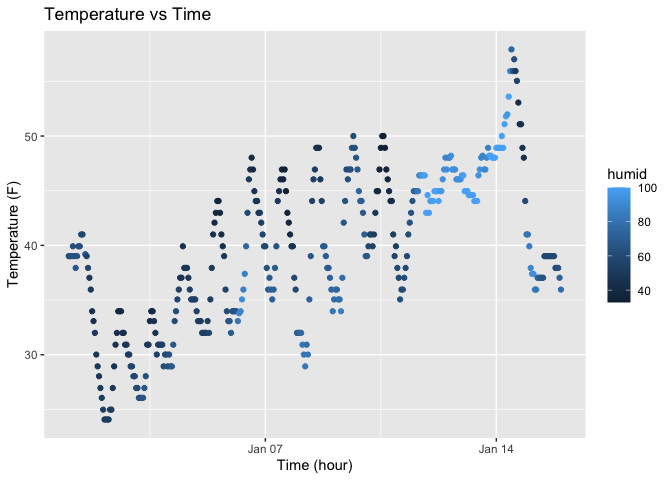

p8105_hw1_yw4665
================
Yishi Wang
2025-09-18

### Problem 0.1 & 0.2

All requirements and recommendations from Problem 0.1 and 0.2 are
properly followed

### Problem 1

Load the ‘moderndive’ library:

``` r
library(moderndive)
```

Load the according dataset. Use ‘help()’ to see dataset description and
variable names:

``` r
data("early_january_weather")
help("early_january_weather")
```

From the RStudio Help panel, we can see that this dataset includes:

**origin**: Weather station.

**year, month, day, hour**: Time of recording.

**temp, dewp**: Temperature and dewpoint in F.

**humid**: Relative humidity.

**wind_dir, wind_speed, wind_gust**: Wind direction (in degrees), speed
and gust speed (in mph).

**precip**: Precipitation, in inches.

**pressure**: Sea level pressure in millibars.

**visib**: Visibility in miles.

**time_hour**: Date and hour of the recording as a POSIXct date.

Now we use ‘nrow()’ and ‘ncol()’ to see the size of the dataset:

``` r
nrow(early_january_weather)
```

    ## [1] 358

``` r
ncol(early_january_weather)
```

    ## [1] 15

Now we use ‘mean()’ to see the mean temperature:

``` r
mean(early_january_weather$temp)
```

    ## [1] 39.58212

Next, we make scatter plot using ‘ggplot2’ package. First load
‘ggplot2’:

``` r
library(ggplot2)
```

Now we create a scatterplot named “plot_time_temp” with proper titles
and different colorings based on humid variable.

``` r
plot_time_temp = ggplot(
  early_january_weather, 
  aes(x = time_hour, y = temp, color = humid)) +
  geom_point() +
  labs(title = "Temperature vs Time",
       x = "Time (hour)",
       y = "Temperature (F)",
       )
plot_time_temp
```

<!-- -->
From the plot we can see that the temperature forms a clear periodic
pattern, where the temperature drops overnight and rises during daytime.
Overall, both temperature and humidity increases from new year to
January 15th as the spikes are getting larger and the scatters are
becoming lighter.

Finally, to save this scatterplot with ‘ggsave’:

``` r
ggsave(filename = "temp_vs_time.png", plot = plot_time_temp)
```

    ## Saving 7 x 5 in image

### Problem 2

First, we import the tidyverse library:

``` r
library(tidyverse)
```

    ## ── Attaching core tidyverse packages ──────────────────────── tidyverse 2.0.0 ──
    ## ✔ dplyr     1.1.4     ✔ readr     2.1.5
    ## ✔ forcats   1.0.0     ✔ stringr   1.5.2
    ## ✔ lubridate 1.9.4     ✔ tibble    3.3.0
    ## ✔ purrr     1.1.0     ✔ tidyr     1.3.1
    ## ── Conflicts ────────────────────────────────────────── tidyverse_conflicts() ──
    ## ✖ dplyr::filter() masks stats::filter()
    ## ✖ dplyr::lag()    masks stats::lag()
    ## ℹ Use the conflicted package (<http://conflicted.r-lib.org/>) to force all conflicts to become errors

Now we create a tibble object with name ‘desired_df’ and assign values
to it. Since we are creating random samples, first set a seed for
reproducibility:

``` r
set.seed(10)
desired_df = tibble(
  random_nums = rnorm(10),
  logicals = random_nums > 0,
  characters = c("a","b","c","d","e","f","g","h","i","k"),
  factors = factor(sample(c("low","med","high"), 10, replace = TRUE))
)

desired_df
```

    ## # A tibble: 10 × 4
    ##    random_nums logicals characters factors
    ##          <dbl> <lgl>    <chr>      <fct>  
    ##  1      0.0187 TRUE     a          high   
    ##  2     -0.184  FALSE    b          med    
    ##  3     -1.37   FALSE    c          high   
    ##  4     -0.599  FALSE    d          med    
    ##  5      0.295  TRUE     e          high   
    ##  6      0.390  TRUE     f          high   
    ##  7     -1.21   FALSE    g          med    
    ##  8     -0.364  FALSE    h          med    
    ##  9     -1.63   FALSE    i          low    
    ## 10     -0.256  FALSE    k          low

Next, we try to get the mean of each variable in this dataframe. We can
get the mean of variable ‘random_nums’ with:

``` r
mean(pull(desired_df, random_nums))
```

    ## [1] -0.4906568

We can also get the mean of variable ‘logicals’:

``` r
mean(pull(desired_df, logicals))
```

    ## [1] 0.3

Getting the mean from the variable ‘characters’ gives us a warning:
“argument is not numeric or logical: returning NA”

``` r
mean(pull(desired_df, characters))
```

    ## Warning in mean.default(pull(desired_df, characters)): argument is not numeric
    ## or logical: returning NA

    ## [1] NA

Getting the mean from the variable ‘factors’ gives the same warning as
well:

``` r
mean(pull(desired_df, factors))
```

    ## Warning in mean.default(pull(desired_df, factors)): argument is not numeric or
    ## logical: returning NA

    ## [1] NA

Next we try to convert the non-numeric values to numeric values with
‘as.numeric’:

``` r
as.numeric(pull(desired_df, logicals))
as.numeric(pull(desired_df, characters))
as.numeric(pull(desired_df, factors))
```

For logical values, they have a numeric form of True=1 and False=0,
therefore they can be properly transformed and be treated as numeric
values. This explains why logical values can have a mean. For character
values, there does not exist a map between number and characters, so
they are forced to become null values (NA), this also explains why we
previously saw a warning. For factor values, they are forced to numeric
values based on their factor level (In this case “high” to 1 “med” to 3
and “low” to 2), but factor variables themselves cannot be treated as
numeric values and therefore cannot have a mean.
